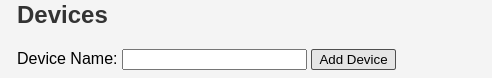

# NewCityMeo

Bienvenue dans le dépôt NewCityMeo!

## Description

NewCityMeo est un programme de monitoring d'écran. Il permet de créer et gérer des campagnes avec différents types de contenu, de les assigner à des dispositifs choisis pour les afficher, de planifier des campagnes, de les ajouter ou les supprimer, et de les activer ou les désactiver.

## Fonctionnalités

- **Création de campagnes** : Créez des campagnes avec divers types de contenu.
- **Gestion des dispositifs** : Assignez des campagnes à des dispositifs spécifiques pour les afficher.
- **Planification** : Planifiez vos campagnes pour une diffusion future.
- **Gestion des campagnes** : Ajoutez, supprimez, activez ou désactivez vos campagnes selon vos besoins.

## Installation

1. Clonez le dépôt :
    ```bash
    git clone git@github.com:Zeishy/NewCityMeo.git
    ```
2. Accédez au répertoire du projet :
    ```bash
    cd NewCityMeo
    ```

## Lancement

1. Démarrez le programme :
    ```bash
    ./run.sh
    ```
2. Accédez à l'interface utilisateur via votre navigateur à l'adresse :
    ```
    http://localhost:8080
    ```

## Utilisation

1. Voici la page principale:
    

2. Premièrement nous allons commencer par créer un 'device' qui va nous permettre d'assigner une campagne a un service précis en cliquant sur le button 'Add Device':

    

    

3. Une fois cela crée, nous pouvons maintenant lancé le programme qui nous permettre de voir l'affichage de l'écran:

    ```
    ./launch-device.sh <ip> <port> <id du device>
    ```

4. Maintenant nous pouvons créer une campagne que l'on va assigner a notre device:

    

    

5. Ajoutez maintenant du contenue à la campagne en cliquant sur manage:

    

6. Pour finir, assigner la campagne à votre device et cliquez sur activate pour que la campagne sois considérée comme active, vous pouvez prévisualiser votre campagne avant de l'activer a l'aide du boutton preview:

    

7. Vous pouvez maintenant voir la campagne active a l'aide de l'ip renseigné en lançant le programme 'launch-device' !